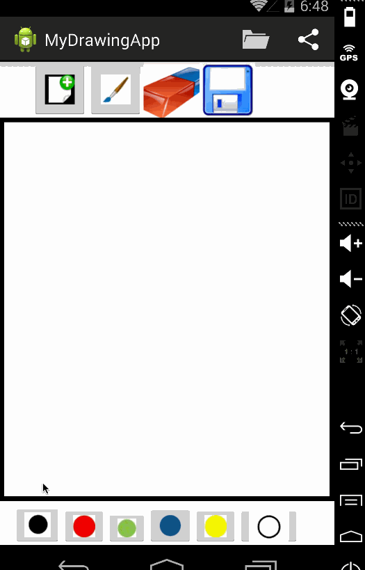

Description: Build a basic drawing app which has color selection, different brush sizes, save and retrieve for various drawings, eraser, and sharing drawing.

Functionalities implemented:

 * [x] User can press down to draw on the canvas.
 * [x] User can choose between at least 6 colors to draw with.
 * [x] User can choose between at least 3 different brush sizes.
 * [x] User can press "New" to clear the canvas and start over.
 * [x] Optional: User can save their drawing and give each drawing a name.
 * [x] Optional: User can open their drawing and select between saved drawings.
 * [x] Optional: User can choose to share out their drawing with other apps.
 * [x] User can erase parts of their drawing - (simple implementation)

Walkthrough of all user stories:

GIF created with [LiceCap](http://www.cockos.com/licecap/).

